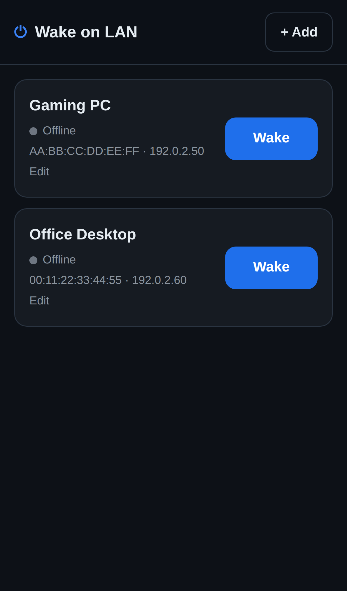

# Wake on LAN for ZimaOS

Power on your PC from your ZimaOS dashboard or from your phone. One tile per
machine, a big **Wake** button, and a live indicator that tells you whether the
PC is already up.



- **No dependencies.** Python standard library only; the image is small and starts instantly.
- **Broadcasts that actually arrive.** Runs with host networking and sprays the magic packet at every broadcast address the Zima box owns, on ports 9 and 7.
- **Knows if it worked.** Status comes from a TCP probe, then ICMP, then the ARP cache — so even a firewalled Windows box usually reports correctly.
- **Phone-friendly.** Touch-sized targets, dark theme, safe-area aware, installable to your home screen.
- **Optional PIN** if you would rather not leave it open on the LAN.

## Before you install: turn Wake-on-LAN on

The container can only send the packet — the PC has to be listening for it.

1. **BIOS/UEFI**: enable *Wake on LAN* / *Power On by PCI-E* / *Resume by LAN*, and disable ErP or Deep Sleep power saving if present.
2. **Windows**: Device Manager → your network adapter → *Power Management* → tick *Allow this device to wake the computer* and *Only allow a magic packet…*; on the *Advanced* tab enable *Wake on Magic Packet*.
3. **Windows fast startup** blocks WoL from a full shutdown. Control Panel → Power Options → *Choose what the power buttons do* → untick *Turn on fast startup*.
4. **Linux**: `sudo ethtool -s eth0 wol g` (make it persistent through your network manager).
5. Use the **wired** NIC's MAC. Wake-on-Wireless rarely works and needs extra setup.

## Install on ZimaOS

### Option A - install the published image (recommended)

1. In ZimaOS open **App Store -> Custom Install** (the *Install a customized app* button).
2. Choose **Import** and paste the contents of [`docker-compose.yml`](docker-compose.yml).
3. Install, then open the app from your dashboard.

It pulls `ghcr.io/mbdevspace/wake:latest`, which is built for amd64 and arm64
and is publicly readable, so the Zima box needs no registry login.

The compose file carries ZimaOS/CasaOS metadata, so the app lands on the
dashboard with a proper name, icon and web-UI link - which is also what makes
it appear in the phone app.

> If a pull ever fails with `denied` or `manifest unknown`, the image for that
> tag has not been published yet. Check the **Build and publish image** workflow
> under the repo's Actions tab, and confirm the package is still public under
> *GitHub -> your profile -> Packages -> wake*. Otherwise use Option B, which
> needs no registry at all.

### Option B - build it on the Zima box (no registry)

SSH into ZimaOS and run:

```sh
git clone -b claude/zima-wake-on-lan-docker-secqqe https://github.com/MBDEVSPACE/wake.git
cd wake
sh install-on-zima.sh
```

(The repo is private, so the Zima box needs your GitHub credentials for that
clone. The `-b` is only needed while this work lives on a feature branch.)

That builds the image locally and starts it on host networking; open
`http://<your-zima-ip>:8055`. If you prefer compose to a script,
`docker compose -f docker-compose.build.yml up -d --build` does the same.

To get the dashboard tile as well, import
[`docker-compose.local.yml`](docker-compose.local.yml) through **Custom
Install**. It points at the image you just built and sets `pull_policy: never`,
so ZimaOS will not reach for a registry.

## Using it from the Zima phone app

Installed apps show up in the ZimaOS mobile app; tapping this one opens the
interface, and the Wake button is right there. Because the UI is a web app you
can also open `http://<your-zima-ip>:8055` in your phone browser and use
**Add to Home Screen** — it then launches full-screen like a native app.

To wake your PC while away from home, use the remote-access method you already
trust for ZimaOS (its built-in remote access, Tailscale, ZeroTier, or a VPN back
to your router). Do not port-forward this app to the internet.

## Configuration

Everything is optional — you can add devices in the UI instead.

| Variable | Default | Meaning |
| --- | --- | --- |
| `WOL_WEB_PORT` | `8055` | Port for the web interface. |
| `WOL_PIN` | *(empty)* | Require this PIN to open the app. Empty disables the prompt. |
| `WOL_CONFIG_DIR` | `/config` | Where `devices.json` is written. |
| `WOL_LOG_LEVEL` | `INFO` | Python log level. |
| `WOL_NAME` / `WOL_MAC` / `WOL_IP` / `WOL_PORT` / `WOL_BROADCAST` | — | Seed a single device on first start. |
| `WOL_DEVICES` | — | Seed several: a JSON array, or `Name=MAC@IP:PORT` entries separated by commas. |

Seeding only happens when `devices.json` does not exist yet; after that the UI
is the source of truth.

### Per-device fields

- **MAC** — required, any common notation (`AA:BB:CC:DD:EE:FF`, `aa-bb-cc-dd-ee-ff`, `aabb.ccdd.eeff`).
- **IP** — optional, only used for the online indicator.
- **Status port** — optional; a port that is open when the machine is up (3389 RDP, 22 SSH, 445 SMB). Gives the fastest, most reliable reading.
- **Broadcast address** — optional; set it (e.g. `192.168.1.255`) if the Zima box and the PC are on different subnets or VLANs.

## HTTP API

Send `X-Wol-Pin: <pin>` on `/api/*` calls when a PIN is configured.

| Method | Path | Purpose |
| --- | --- | --- |
| `GET` | `/api/session` | Whether a PIN is required (no auth needed). |
| `GET` | `/api/devices` | List devices. |
| `POST` | `/api/devices` | Add a device. |
| `PUT` | `/api/devices/{id}` | Update a device. |
| `DELETE` | `/api/devices/{id}` | Remove a device. |
| `POST` | `/api/devices/{id}/wake` | Send the magic packet. |
| `GET` | `/api/status` | Online state for every device. |
| `GET` | `/healthz` | Health check. |

Handy for a shortcut or automation:

```sh
curl -X POST -H "X-Wol-Pin: 1234" http://zima.local:8055/api/devices/<id>/wake
```

## Troubleshooting

**The packet sends but the PC stays off.** Almost always the PC side: re-check
fast startup, the adapter's power settings, and that you used the wired MAC.
After a full power loss many boards forget the WoL setting.

**"Could not send the magic packet".** The container is not on host networking.
A bridged container cannot broadcast onto your LAN — keep `network_mode: host`.

**Status always shows Offline while the PC is on.** Add a status port the
machine actually has open. Windows blocks ping by default, which is why the TCP
probe exists.

**Different VLAN or subnet.** Fill in the broadcast address for that subnet and
make sure your router forwards directed broadcasts — many do not, by design.

**Port 8055 already used.** Change `WOL_WEB_PORT` (and the `port_map` value in
the compose file if you installed via ZimaOS).

**`denied` or `manifest unknown` when ZimaOS pulls the image.** `denied` means
the package is private or does not exist; `manifest unknown` means the package
is reachable but that tag was never pushed. Both point at the publishing
workflow rather than your box - see the note in Option A, or switch to
Option B and build locally.

## License

MIT
